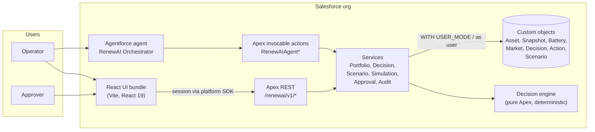

# RenewAI Orchestrator – Architecture

One deterministic decision engine, three ways in (React app, Apex REST, Agentforce agent), one audit trail.



## Decision path

```mermaid
sequenceDiagram
  participant U as Operator
  participant R as REST / Agent action
  participant S as Decision service
  participant E as Engine
  participant D as Decision__c / Action__c
  participant A as Approver

  U->>R: Run decision (objective, time)
  R->>S: validate and load portfolio
  S->>E: context
  E-->>S: 9 candidates, constraints, scores, winner
  S->>D: save (Approval Pending or Not Required)
  S-->>U: result + correlation id
  opt Approval Pending
    A->>R: Approve / Reject (+ note)
    R->>D: status, who, when, note; actions Planned or Rejected
  end
```

## Where each guarantee lives

| Guarantee | Where |
|---|---|
| Same input, same answer | `RenewAIDecisionEngine` is pure Apex: fixed candidate order, fixed constants, no randomness, no AI call. |
| AI never sets a number | Agentforce only calls Apex actions and explains their output. |
| Hard limits cannot be traded away | Constraint checks reject a candidate before scoring. |
| Low-confidence plans need a person | `Approval_Status__c = Pending`; actions stay `Awaiting Approval`. |
| Only approvers approve | Custom permission `RenewAI_Approve_Decisions`; refusals are 403 `APPROVAL_NOT_PERMITTED`. |
| Users only see what their access allows | `with sharing`, `WITH USER_MODE`, `insert/update as user`. |
| Everything is traceable | Correlation id on every response, saved on `Decision__c`; approver, time and note saved on approval. |
| Failures are visible | Structured errors; the React app keeps the last good result and labels it a fallback. |

## Permission sets

| Set | Purpose |
|---|---|
| `RenewAI_Operator` | Read portfolio data |
| `RenewAI_Decision_Access` | Run and save decisions |
| `RenewAI_Scenario_Access` | Scenarios and simulations |
| `RenewAI_Agent_Access` | Agent actions |
| `RenewAI_Approver` | Approve or reject Pending decisions |
| `RenewAI_Audit_Access` | Read approval notes and approvers |
| `RenewAI_Admin` | Everything, for setup |
